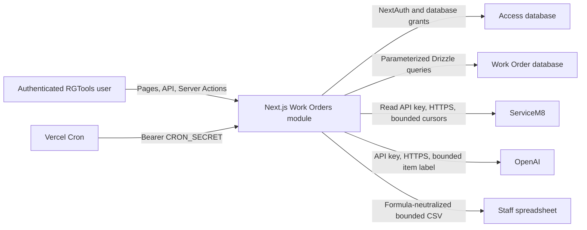

# Threat model - mt-192-workorder-changes

- Method: retrofit, reverse-engineered from current code
- Date: 2026-07-16
- Verdict: **PASS; no open gate threat**

## Data flow and trust boundaries

## STRIDE assessment

| Threat | STRIDE | Mitigation | Residual |
|---|---|---|---|
| Direct refresh invocation | Elevation/tampering | Manage authorization at callable boundary | Low |
| Partial/looping provider pages | Tampering/DoS | Complete cursors, repeated-cursor rejection, 25-page cap, timeout | Low |
| Removal between item read/write | Tampering/repudiation | Active-row conditional update and two-connection proof | Low |
| Repeated refresh/AI calls | DoS | Durable leases, per-user windows, timeouts, page/export caps | Low |
| Forged item/option | Tampering | UUID and option validation plus active-row writes | Low |
| Label/change repudiation | Repudiation | Atomic item event/global audit with actor | Low |
| Spreadsheet formula injection | Injection | Prefix neutralization and CSV quoting | Low |
| Provider error disclosure | Information disclosure | Safe fixed errors; provider bodies are not surfaced | Low |
| Raw snapshot/history retention | Information disclosure | No new raw snapshots; 7-year/2-year cleanup; protected weekly cron | Low; deployment confirmation required |
| Cron misuse | Elevation/DoS | Strong bearer secret, fail-closed 401, no response PII | Low; target secret is a deployment prerequisite |

The current dependency audit is clean, isolated runtime evidence passes, and no High/Critical or applicable failing threat remains.
